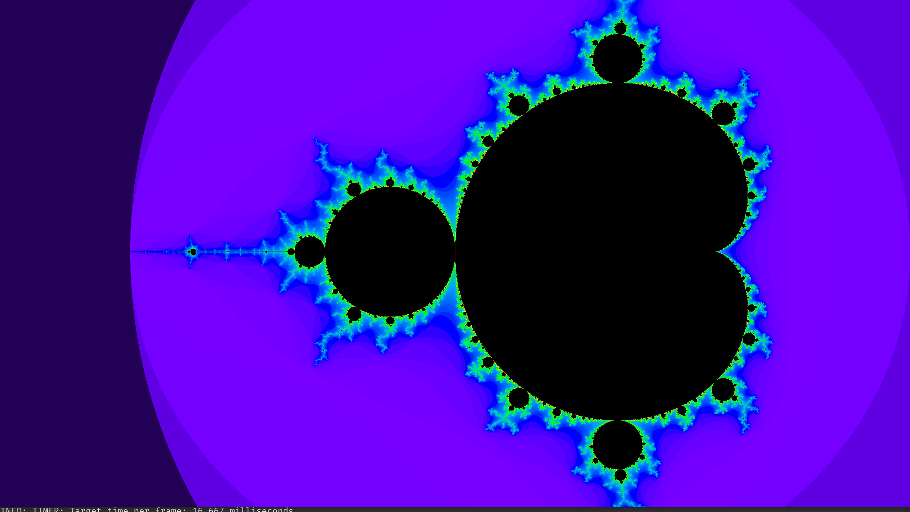
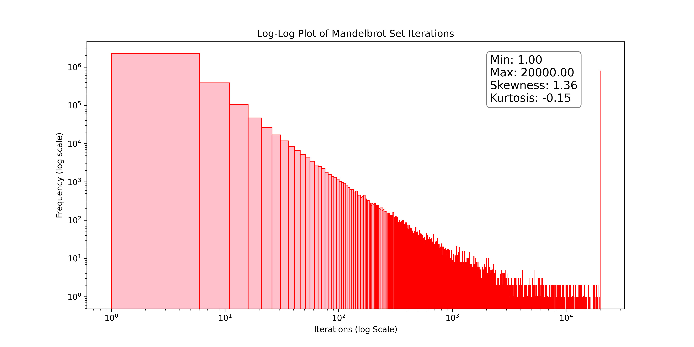

# MandelCuda

## Description

MandelCuda is a very minimalistic show case of CUDA for the calculation of the Mandelbrot set
and its boundaries.

## Mathematical Overview

The iteration inside the Mandelbrot set generation loop, as found in the [MandelbrotKernel](https://github.com/IstiCusi/mandelcuda/blob/main/mandel_cuda.cu#L21-L26) 
is mathematically very simple and represented by:

$$
z_{n+1} = z_n^2 + c
$$

where \( z_0 = 0 \) and \( c = x_0 + iy_0 \), with \( x_0 \) and \( y_0 \) being the real and imaginary parts of \( c \), calculated from the pixel coordinates. For each iteration, the process is:

1. Calculate the real part of \( z_{n+1} \):
$$
\text{Real}(z_{n+1}) = x^2 - y^2 + x_0
$$

2. Calculate the imaginary part of \( z_{n+1} \):
$$
\text{Imaginary}(z_{n+1}) = 2xy + y_0
$$

This iteration continues until either the magnitude of \( z_n \) squared (\( x^2 + y^2 \)) exceeds 4,
indicating the point does not belong to the Mandelbrot set, or the maximum number of iterations is reached.

## Installation

Compile the mandelcute-iness using `make`

## Contributing

Any contribution is welcome!

## License

This project is open-source and is licensed under the MIT License. Please see the 
[LICENSE](LICENSE.md) file for detailed licensing information.

## TODOS

- Complete API documention 
- Extend about better coloring schemes and zooming etc
- The coloring is based on a heuristic assumption of the distribution of iterations 
  (A better color mapping could be done in sequence)
